# Developer: Aldwin Arriola

## Table of content
1. [Purpose of the project](#purpose-of-the-project)
2. [User stories](#user-stories)
3. [Features](#features)
4. [Typography and color scheme](#typography-and-color-scheme)
5. [Wireframes](#wireframes)
6. [Technology](#technology)
7. [Testing](#testing)
   - 7.1 Code Validation
   - 7.2 fixed bugs
   - 7.3 supported screens and browsers
   - 7.4 test cases
8. [Deployment](#deployment)
   - via gitpod
   - via github pages
9. [Credits](#credits)


## Purpose of the project
The purpose of this project is for Project #2(JavaScript), this is part of me achieving the Diploma in Full Stack Software Development at [Code Institute](https://codeinstitute.net/).besides this it is a General Knowledge, Fun Trivia question quiz game project, it can provide more knowledge for the User.

## User stories
 as a User:
   - there should be a button in the main menu that I can click to start the game. 
   - I should also be able to see what the rules of the game are.
   - must have the option to continue or exit the game before starting such game.
   - while I am playing I should see my score.
   - I should have a choice of my answer for the questions.
   - there should also be a timer that I can see on display.
   - I should be able to see the number of questions and how many more questions I have.
   - when I answer the questions wrong I should see the correct answer.
   - and when my answer is correct, my score should increase.
   - when I run out of time and the question is not answered,<br>I should still see the correct answer, but my score will not be increased or decreased.
   - after answering all the questions I should see my total score.
## Features
- ### A Simple, Easy to Remember URL:[History Trivia Quiz](https://araldwin.github.io/Project-2/)
-----
- Main menu of the game with start button.
   <details><summary>Main menu screen shot</summary>
   <p> 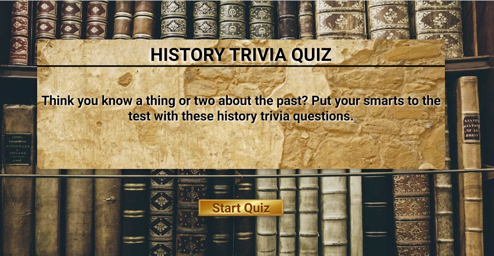 </p>
   </details>
-----
- Rules of the quiz with option to start or exit the game.
   - Exit button - click this will return back to main menu
   - Continue button - click this will proceed to the main game.
   <details><summary>Rules of the game screen shot</summary>
   <p> 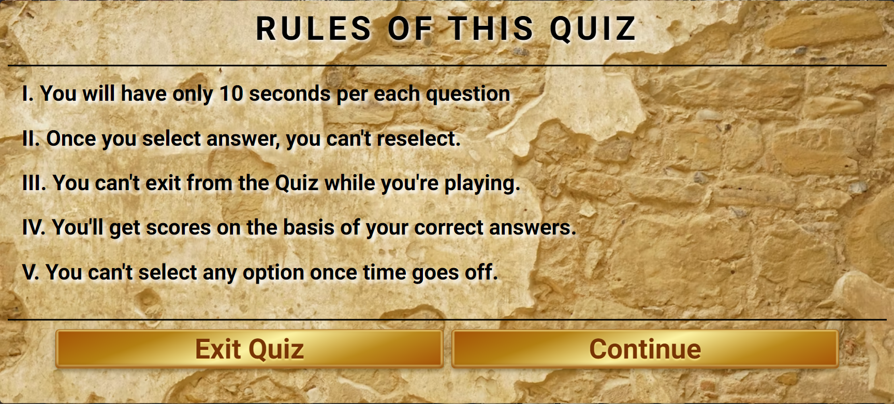 </p>
   </details>
-----
- Main game
   - User score that increments every correct answer.
   - Timer
   - A display of the question and choices of answer.
   - Display tick when answer is correct and cross if answer is wrong.
   - Total of questions and question number.
   - Next button after answering each question.
      <details><summary>Main game screen shot</summary>
      <p> 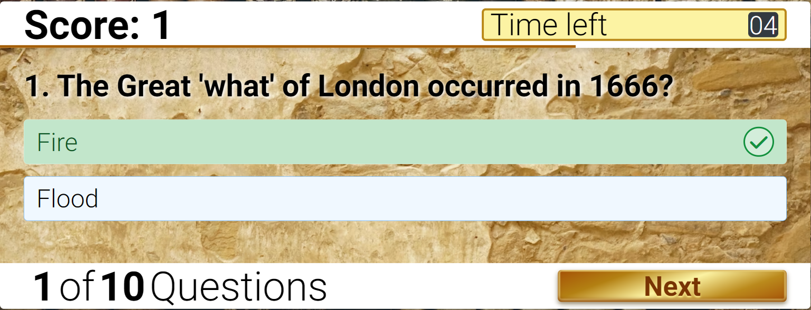 </p>
      </details>
   -----
   - If User answer is wrong it will display the correct answer, and it will not increment user score.
      <details><summary>display user correct answer screen shot</summary>
      <p> 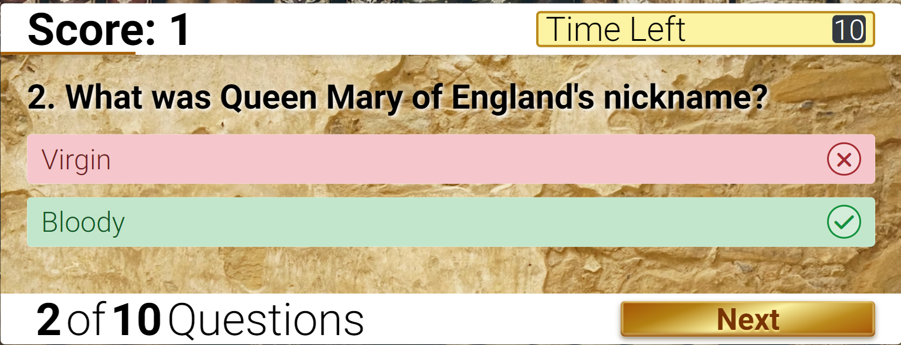 </p>
      </details>
   -----
   - If User timer is off it will display correct answer but will not increment score.
      <details><summary>display timer off screen shot</summary>
      <p> 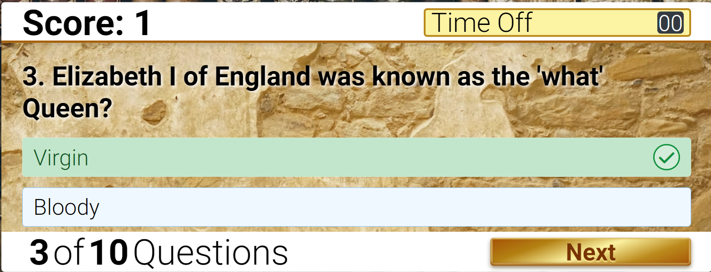 </p>
      </details>
-----
- End game
   - Display final score of the User.
   - Button to quit the game and return to Main menu.
      <details><summary>display end game screen shot</summary>
      <p> 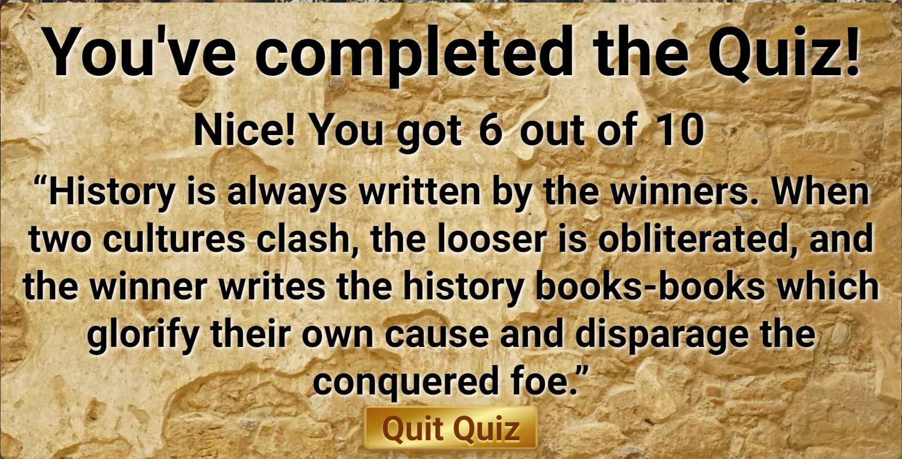 </p>
      </details>
-----

- 404page
    <details><summary>display end game screen shot</summary>
      <p> 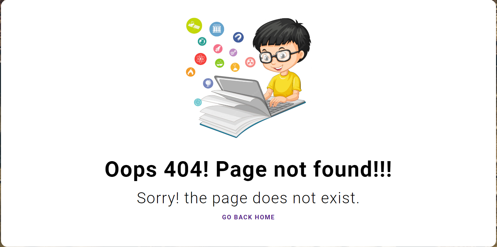 </p>
      </details>


-----
- ### This website is mobile friendly(mostly Apple products) or responsive design that fits only in standard screen sizes given below.

   <details><summary>amiresponsive screen shot</summary>
      <p> 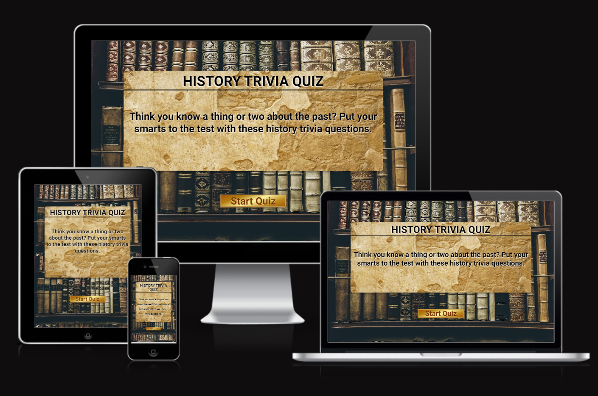</p>
      </details>

      ```
      Desktop = 1600x992px 
      Laptop = 1280x802px 
      Tablet = 768x1024px 
      Mobile = 320x480px 
      
      Apple devices:
      iPad Pro = 1024x1366px
      iPad and iPad Mini = 768x1024px
      iPad Air = 820x1180px
      iPhone 13 Pro Max = 428x926px
      iPhone 13, iPhone 13 Pro, iPhone 12 Pro = 390x844px
      iPhone X = 375x812px
      iPhone 5 = 320x568

      Xiaomi mi10T 5g = 393x873px
      ```


 - ### Future features
      - A background music.
      - More history trivia questions.
 -----     
## Typography and color scheme
### Typography
   <details><summary>color scheme screen shot</summary>
      <p> 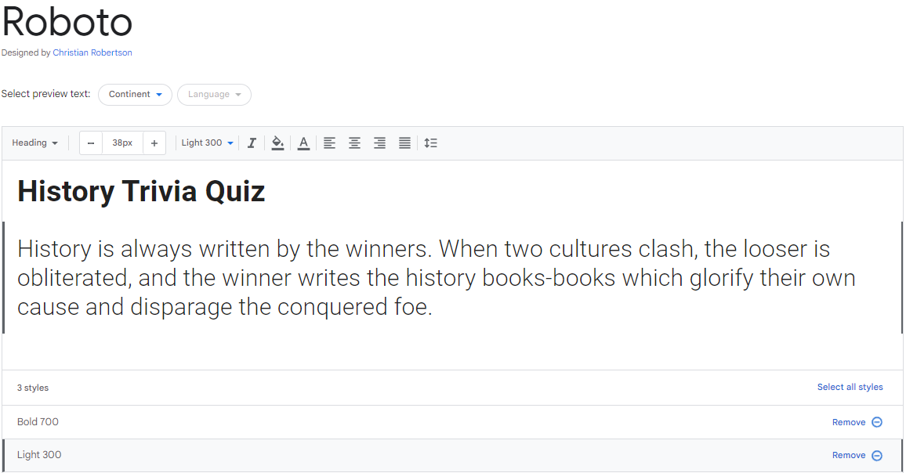</p>
      </details>

   - I used Roboto fonts in this project with fall back being Sans-serif. This Font is simple and adapted to the website and it is linked to the CSS document via @import.

### Color Scheme 
   <details><summary>color scheme screen shot</summary>
      <p> 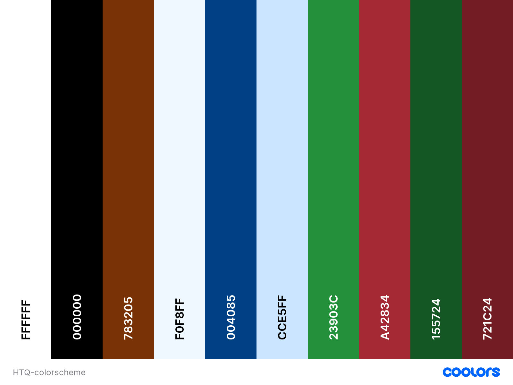</p>
      </details>
   
   - In this website I used black #000000 for the Fonts and white #FFFFFF for the text shadow. I also used different colors for the style of the buttons and other backgrounds. like Chocolate tradition #783205 as the main color of the buttons to get its golden style. next are the other colors I used.Alice Blue#F0F8FF,Dark Cornflower #004085, Beau Blue #CCE5FF, Forest Green Web #23903C, Crimson UA #A42834, Lincoln Green #155724, and Persian Plum #721C24. other colors not mentioned are border color and box shadow. i used these colors to match the theme of the website.
-----
## Wireframes
- [Balsamiq](https://balsamiq.com) - i used balsamiq to create [wireframes](https://balsamiq.cloud/shny6lm/pz4i6g4/rE2F0) for my project.
-----
## Technology
### Languages used
- HTML5
- CSS3
- JavaScript
### Others
- [Am I Responsive](https://ui.dev/amiresponsive) - - online tool used to create mockup to present responsive design of this project.
- [Coolors.co](https://coolors.co) - used to create color palette.
- [Fontawesome](https://fontawesome.com/icons/) - where i import font icons for this project.
- [favicon.io](https://favicon.io/favicon-generator/) - generator i use to create favicon for this project.
- [Google Fonts](https://fonts.google.com) - where i import and use font-style for this project.
- [Git](http://gitscm.com) - Git was used for version control by utilizing the Gitpod terminal to commit to Git and Push to GitHub.
- [Gitpod](https://gitpod.io) - IDE used to code the project.
- [GitHub](https://github.com) - GitHub is used to store the project's code after being pushed from Git.
- [Visual Studio Code for Windows]() - IDE used to code the project.
- [Unsplash](https://www.unsplash.com/) - for the webpage main background image.
- [Windows Snipping Tool] - used to save the screen shot.
- [Google developer tools]
-----
## Testing
-----
### 7.1 Code Validation
-----
- [JS Hint](https://jshint.com/) - used to check JavaScript codes.


-----
- [W3C CSS Validation Service](https://jigsaw.w3.org/css-validator/#validate_by_input) - used to validate the project css.
<p>
    <a href="http://jigsaw.w3.org/css-validator/check/referer">
        
    </a>
</p>
<p>
<a href="http://jigsaw.w3.org/css-validator/check/referer">
    
    </a>
</p>


-----
- [Nu Html Checker](https://validator.w3.org/nu/#textarea) - used to check the project html.
#### Index.html


-----
### Lighthouse report


-----
### 7.2 fixed bugs
-----

- i had a problem with the title box where even if i click start qiuz it doesn't disappear, which it should disappear.
- to solve this problem i simply change the:
    - titleBox_rmv.classList.remove("title_box"); into titleBox_rmv.style.display = "none";
    - titleBox_rmv.classList.add("title_box"); into titleBox_rmv.style.display = "block";

-----
### 7.3 supported screens and browsers
-----
- Supported browsers
   - Google Chrome
   - Microsoft Edge
   - Safari

- Supported screens
   - Such a viewport was obtained from the am i responsive website where it was used to have an appropriate size for responsive design.
   - Apple products:
      - iPad Pro = 1024x1366px
      - iPad and iPad Mini = 768x1024px
      - iPad Air = 820x1180px
      - iPhone 13 Pro Max = 428x926px
      - iPhone 13, iPhone 13 Pro, iPhone 12 Pro = 390x844px
      - iPhone X = 375x812px
      - iPhone 5 = 320x568
   - I used google developer tools to test the responsiveness of given iPad and iPhone devices.  
-----
### 7.4 Test Cases
| Test<br>Case<br>ID | Test Case<br>Description | Test Steps | Test Data | Expected<br>Result | Actual<br>Result| Pass/Fail |
| :---: | :---: | --- | --- | --- | :---: | :---: |
| TC01 | Click Start Quiz. | 1. Go to https://araldwin.github.io/Project-2/.<br>2. Click Start Quiz button. | Click Start Quiz button | 1. User must proceed to<br>rules of the quiz.<br>2. User should see two box,<br>Exit and Continue Box. | As expected | Pass<br><details><summary>TC01 screen shot</summary>  </p> </details> |
| TC02 | Click Exit Quiz<br>button in Rules of the<br>quiz. | 1. Continuing TC01 in Rules of the quiz box.<br>2. Click Exit quiz button.  | Click Exit quiz button | 1. User will Exit rules of the quiz box.<br> 2. User will proceed home<br>where the Start Quiz button is,<br>afer clicking Exit quiz button.  | As expected | Pass<br><details><summary>TC02 screen shot</summary>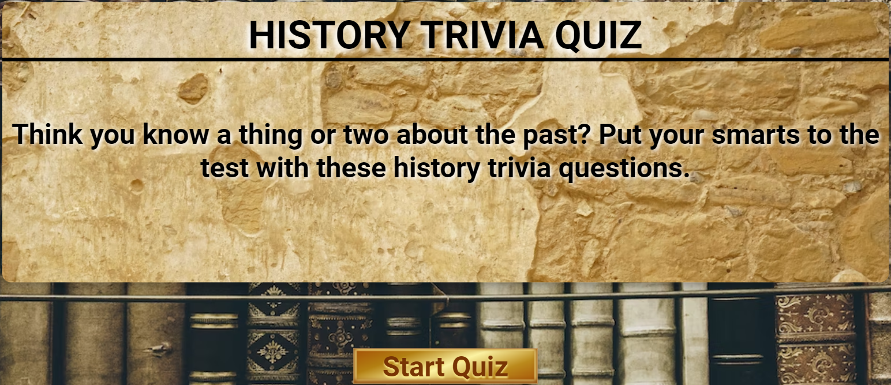</p></details> |
| TC03 |  Click Continue<br>button in Rules of the<br>quiz. | 1. Continuing TC01 in Rules of the quiz box.<br>2. Click continue button. | Click continue button | 1. User must proceed to<br>Main Game.<br> | As expected | Pass<br><details><summary>TC03 screen shot</summary>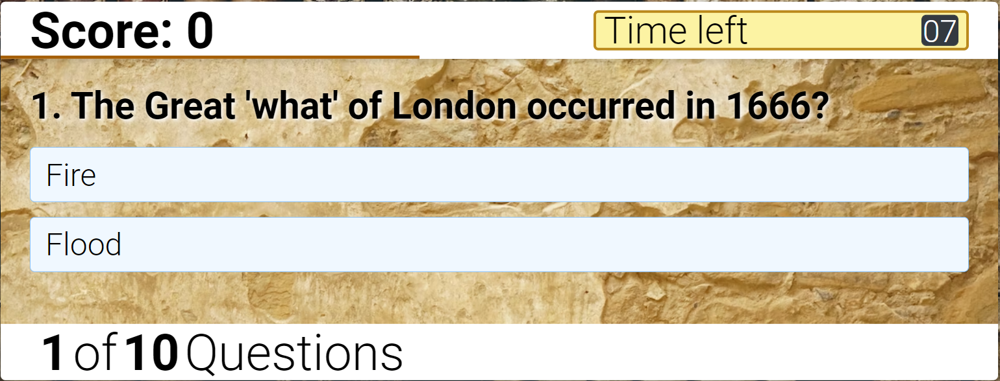</p></details> |
| TC04 | When User select Correct<br>answer | 1. In Main Game Question number 1.<br>2. Click Fire(correct answer). | Click on Fire | 1. User score will Increment.<br>2. Timer will stop after selecting the answer.<br>3. A tick icon will display when user answer is correct.<br>4. Next button will appear at the right bottom corner of the box. | As expected | Pass<br><details><summary>TC04 screen shot</summary>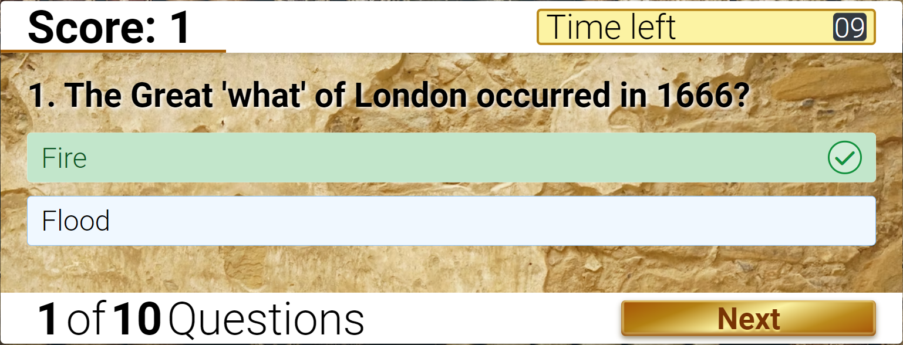</p></details> |
| TC05 | Proceeding to the next Question. | 1. In Main Game Question number 1.<br>2. User select an answer.<br>3. Click Next. | 1. Select Answer<br>2. Click Next button. | 1. User will proceed to the next question number 2.<br>2. it will increment Question index. | As expected | Pass<br><details><summary>TC05 screen shot</summary>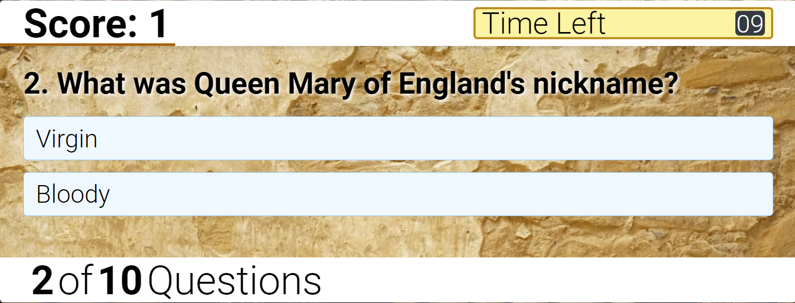</p></details> |
| TC06 | When User select Incorrect<br>answer | 1. Continuing TC05 question number 2.<br>2. Click Virgin(incorrect answer).  | Click on Virgin | 1. User score will not increment.<br>2. Timer will stop after selecting the answer.<br>3. A cross icon will display when user answer is incorrect.<br>4. It will display the correct answer with tick icon.<br>5. Next button will appear.| As expected | Pass<br><details><summary>TC06 screen shot</summary>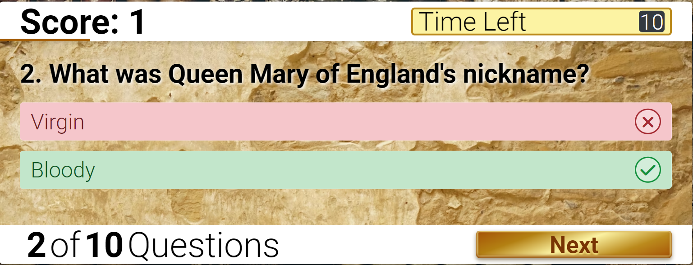</p></details> |
| TC07 | When User run out of time. | 1. Continuing TC06<br>question number 2<br>2. Click Next button to proceed to the next<br>question number 3.<br>3. Let the time run out. |  Let the time run out | 1. User score will not increment.<br>2. Timer display Time left will change into Time Off.<br>3. The correct answer will display.<br>4. Next button will appear. | As expected | Pass<br><details><summary>TC07 screen shot</summary>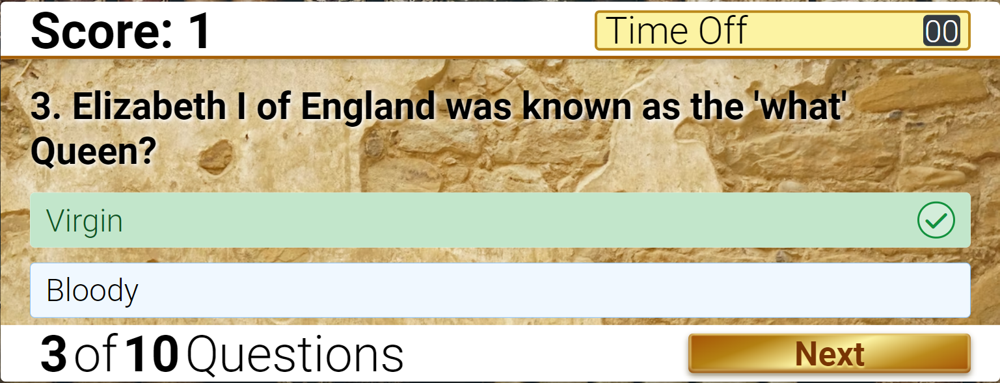</p></details> |
| TC08 | End of the game<br>Final score | 1. Answer all the 10 question.<br>2. On 10th question<br>click next button.  | click next button | 1. It will diplay a message and quote.<br>2. Display User total score out of 10.<br>3. Quit quiz button display  | As expected | Pass<br><details><summary>TC08 screen shot</summary>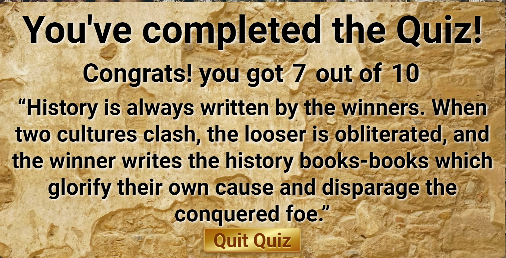</p></details> |
| TC09 | Click Quit quiz button | 1. Continuing TC08 end game.<br>2. Click Quit quiz button. | Click Quit quiz button | 1. User will proceed to Main menu/Home. | As expected | Pass<br><details><summary>TC09 screen shot</summary>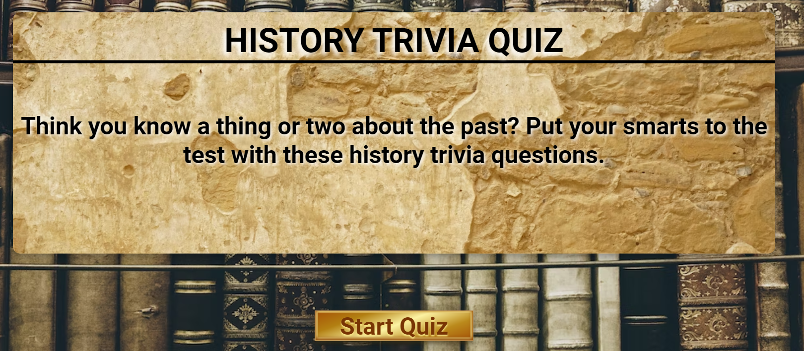</p></details> |

## Deployment
- via gitpod
   - go to and log in to [github](https://github.com/).
   - after login. on the top right side of the page next to the bell icon click on the "+" and select "New repository".
   - now i can create a new repository. put repository template, repository name, its description and other options, after that just go to the bottom and press "Create repository" and then it take me to gitpod.

- via github
   - go to and log in to [github](https://github.com/).
   - go to repository and choose [Project-2](https://github.com/araldwin/Project-2).
   - after that head to [setting](https://github.com/araldwin/Project-2/settings).
   - find and click "Pages" in the Code and Automation column.
   - select "deploy from a branch" in Source, select "main" and "root" in Branch and save.
      
   - click the given weblink [araldwin.github.io/project-2/](https://araldwin.github.io/Project-2/).

## Credits
   - [trivianerd.com](https://www.trivianerd.com/trivia-questions#history-trivia) - where i get my trivia questions with answers.
   - [yesviz.com](https://yesviz.com/viewport/) - where i got all my view port for smart phone devices.
   - [codingnepalweb.com](https://www.codingnepalweb.com/quiz-app-with-timer-javascript/) - Tutorial watched and used to create this game idea.
   - [W3C School](https://www.w3schools.com/) - for more knowledge that I learned.
   - [stackoverflow.com/](https://stackoverflow.com/) - get ideas how to solve some of problems into my codes.
   - Code institute README.md Template
   - Google images for the background
## Acknowledgements
   - Mr. Rohit to my mentor
   - Student Support
   - Slack community
   - Code institute

## Disclaimer
   - History Trivia quiz was created for educational purpose only.